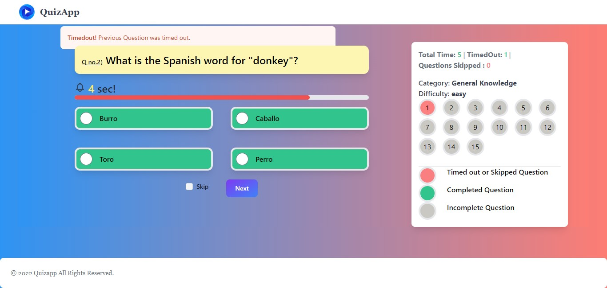

# Quiz App using Svelte + Vite

Welcome to the QuizApp repository! The Svelte framework and Vite as the build tool were used to create this straightforward quiz application. Users of the QuizApp can take quizzes on a variety of subjects and receive immediate feedback on their responses.

## Question data

Questions and answers data are fetched from website: [Opentdb](https://opentdb.com/api.php?amount=15&category=9&difficulty=easy&type=multiple)

## Features

    - Fetched data from api webite opentdb.com.
    - Take quizzes on a variety of topics.
    - Marks based on time spent by user on the question.
    - User-friendly and responsive design.
    - Randomized question order for a fresh experience every time.



## Table of Contents

- [Getting Started](#getting-started)
- [Folder Structure](#folder-structure)
- [Contributing](#contributing)

## Getting Started

To get a local copy of the QuizApp up and running, follow these steps:

1. Clone this repository to your local machine:

```console
    git clone https://github.com/shardz9090/Quiz-App.git
```

2. Navigate to the project directory:

```console
    cd Quiz-app
```

3. Install the project dependencies:

```console
    npm install
```

4. Start the development server:

```console
    npm run dev
```

5. Open your web browser and go to http://localhost:5173 to view the QuizApp.

## Folder Structure

The project structure is organized as follows:

    - src/: Source code for the QuizApp.
        - lib/: Svelte components used in the application.
            - details/ : Svelte Components
        - App.css
        - App.svelte: The main Svelte component.
        - main.js: The entry point for the application.
        - vite.config.js: Configuration file for Vite.

## Contributing

Contributions are welcome! If you'd like to contribute to this project, please follow these steps:

    1. Fork the repository.
    2. Create a new branch for your feature or bug fix.
    3. Make your changes and commit them.
    4. Push your changes to your fork.
    5. Submit a pull request to the main repository.

Thank you for checking out the QuizApp! If you have any questions or encounter any issues, please feel free to open an issue in this repository.
